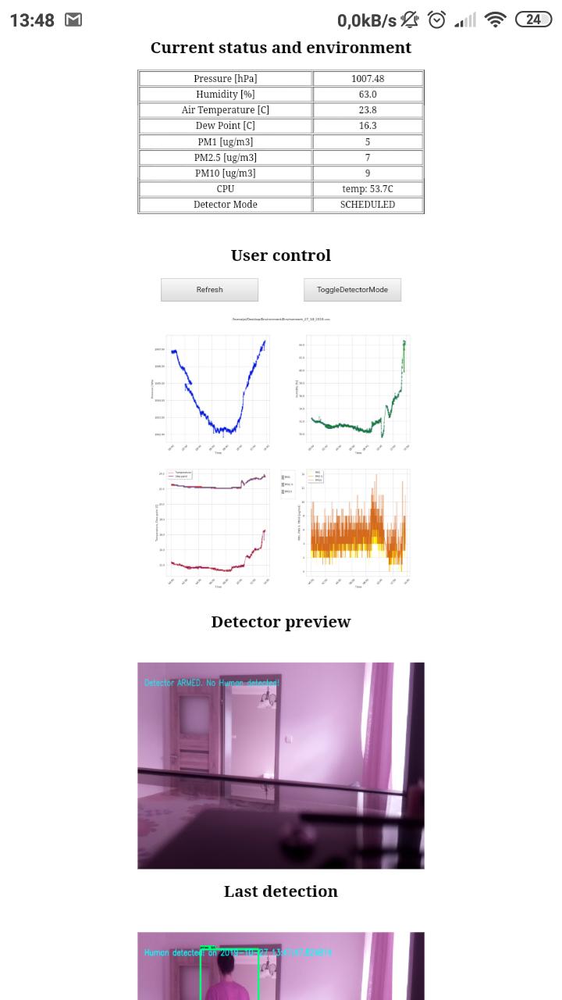

# HomeMonitoring
Project in python with some object detection algorithms based on tensorflow, environment monitoring and logging. 
Current readings and plots can be viewed on a webpage on port 8081.
Hardware: Raspberry Pi3 B, BMP180, AM2302, RPi3 camera module v2, PMS7003.

